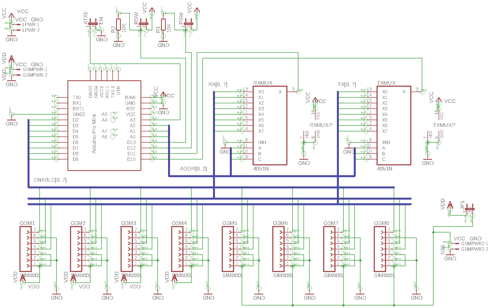
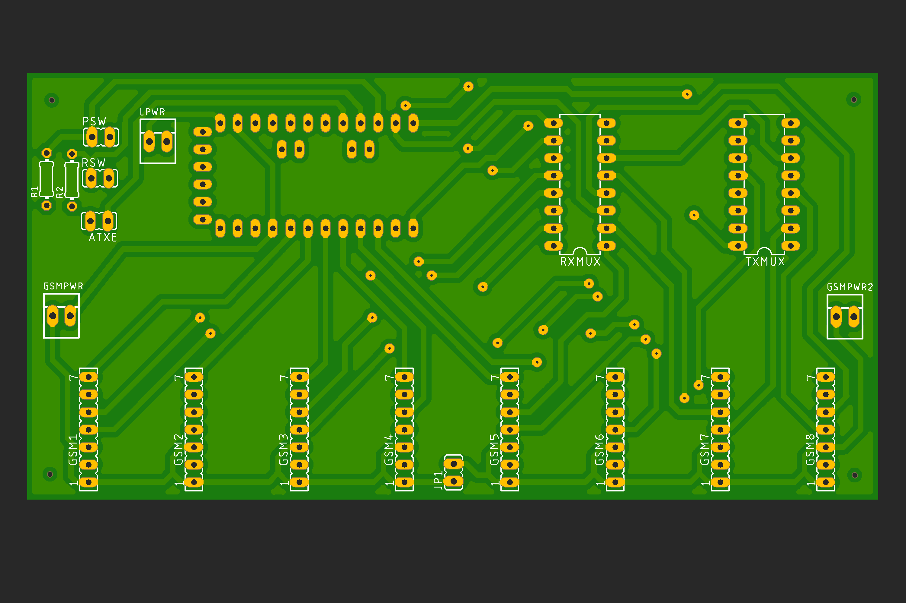

# SimTRON

MultiSim SMS device !

This repo contains source code and hardware specifications for building a 8 SIMs communications device to monitor SMS reception on up to 8 mobile lines.

# Hardware

The device is based on an Arduino PRO mini, running at 16 MHz and 5V. Board designed using Eagle Cad, sources under **hardware** folder.

## Schematic:

<p align="center" >
  
</p>

## Board:

<p align="center" >
  
</p>

## Connections:

- **PSW:** power switch, connect the ATX power switch.
- **RSW:** reset switch, connect the ATX reset switch.
- **ATXE:** ATX enable signal, connect, from left to right: ATX Black (GND), ATX Green (Enable)
- **LPWR:** Logic power: connect, from left to right: ATX Purple (5V SB), ATX Black (GND)
- **GSMPWR:** GSM modules [1 to 4] power: connect, from left to right: ATX Red (5V), ATX Black (GND)
- **GSMPWR2:** GSM modules [5 to 8] power: connect, from left to right: Any alternative 5V poser supply (can be ATX Yellow (12V) through a 5V DC-DC step down, ATX Black (GND)
-- Take into account that you don't need to connect this power connector if you closes the JP1 jumper. In this case, all GSM modules will be powered through GSMPWR connector.
- **GSM[1..8]:** gsm modules, take into account polarity, reset pin on GSM module marked as 7 in board.

## List of materials

| Name | link | Unit price | Quantity | Total price |
|------|------|------------|----------|-------------|
| IC 74HC4051 | https://www.amazon.es/cd74hc4051e-Analog-Channel-CKT-16-Ti/dp/B01JV6VPJ8/ref=sr_1_fkmr1_1?ie=UTF8&qid=1528913467&sr=8-1-fkmr1&keywords=analog+mux+4051 | 3.50 € | 1 | 3.50 € |
| GPRS SIm800L Modem | https://www.amazon.es/Sharplace-SIM800L-Tarjeta-Cuatribanda-QUAD-BAND/dp/B075D9ZYPW/ref=sr_1_16?ie=UTF8&qid=1528789781&sr=8-16&keywords=sim800l | 12.99 € | 8 | 103.92 € |
| Arduino Pro Mini 328P | https://www.amazon.es/Arduino-ATMEGA328-Avr328P-desarrollo-development/dp/B01DLPAAAK/ref=sr_1_2?ie=UTF8&qid=1528790069&sr=8-2&keywords=arduino+pro+mini | 5 € | 1 | 5 € |
| FTDI USB Adapter | https://www.amazon.es/tinxi%C2%AE-FT232RL-adaptador-convertidor-Arduino/dp/B01C2P9GD2/ref=sr_1_8?s=electronics&ie=UTF8&qid=1528790180&sr=1-8&keywords=ftdi+usb | 5.99 € | 1 | 5.99 € |
| Mini USB to Micro USB cable | https://www.amazon.es/Extensi%C3%B3n-Adaptador-Dispositivo-Charger-Converter/dp/B01MEDCEBJ/ref=sr_1_6?s=electronics&ie=UTF8&qid=1528911416&sr=1-6&keywords=mini+usb+to+micro+usb | 7.99 € | 1 | 7.99 € |
| Raspberry PI Zero W Starter kit | https://www.amazon.es/PiHut-Zero-Essentials-Kit-Raspberry/dp/B06XCYGP27/ref=sr_1_5?ie=UTF8&qid=1528790276&sr=8-5&keywords=raspberry+pi+zero+w | 25 € | 1 | 25 € |
| Micro ATX enclosure | https://www.amazon.es/gp/product/B00TKP0E34/ref=oh_aui_detailpage_o01_s00?ie=UTF8&psc=1 | 46.95 € | 1 | 46.95 € |
| Manufactoring at China | https://www.pcbway.com/ | 10 € | 1 | 10 € |

Total price: 208.35 €

## Printed parts

<p align="center" >
  
</p>

This part has been designed to support the 8 Bnc antennas, fitting in any ATX case back side. You can print it with any 3D printer.

# Firmware

The firmware is under the **firmware** folder, you can use Arduino IDE to mod or add new features.

## Interface

The firmware uses **Serial** interface to communicate with host computer, the commands follows a simple text protocol, one command on each line and with following structure:

`commandOpCode param1 param2 param3`

Commands response are valid JSON objects.

### Available commands:

**Status command:**

`status channelNo`

Param: int, GSM channel number, 0 to 7

Response:

```javascript
{
  "type": "status",
  "channel": int, // the channel: 0 to 7
  "power": "string", // whether the ATX power is "on" or "off"
  "isEnabled": int, // whether the channel is enabled (1) or not (0)
  "icc": "string", // full ICC of the sim, if not sim inserted, empty icc will be returned
  "msisdn": "string", // full msisdn of the sim, if no sim inserted, empty msisdn will be returned, also, if unknown msisd, a question mark will be returned "?"
  "networkStatus": int, // 1 to 10, indicating the GSM network status of the channel
  "status": "string" // descriptive and printable message for networkStatus
}
```

**Catalog command:**

`catalog`

Response:

8 status objects, one per GSM channel (see status command)

**Enable command:**

`enable channelNo`

Param: int, GSM channel number, 0 to 7

Response:

Same response than status command.

**Disable command:**

`disable channelNo`

Param: int, GSM channel number, 0 to 7

Response:

Same response than status command.

**Send SMS command:**

`sendSms channelNo destinationMsisdn "SMS text"`

Params:
- int channelNo: GSM channel number, 0 to 7, this channel will be used as sender.
- string senderMsisdn: MSISDN to send to.
- string smsText: short text to send as SMS (max 130 chars)

Response:

if SMS sent correctly:

```javascript
{
  "type": "info",
  "body": "SMS sent"
}
```

if not:

```javascript
{
  "type": "error",
  "body": "Error sending SMS"
}
```

**Reset command:**

`reset`

Response:

No response, the system will reset and boot messages will be shown.

**Support command:**

`support`

Response:

```javascript
{
  "type": "support",
  "body": "Simtron v1.0.0 get support at https://github.com/wyunreal/simtron"
}
```

## Push messages

The device can send messages to the host computer without the needding of a command, these messages are:

**Boot started:**

```javascript
{
  "type": "booting",
  "body": "Booting Up ..."
}
```

**Boot completed:**

```javascript
{
  "type": "booting",
  "body": "System ready ..."
}
```

**SMS Received:**

```javascript
{
  "type": "sms",
  "channel": int, // the channel: 0 to 7, receiver of the SMS
  "icc": "string", // full ICC of the sim receiving the SMS
  "msisdn": "string", // full msisdn of the sim receiving the SMS, if unknown msisd, a question mark will be returned "?"
  "sender": "string", // sender MSISDN;
  "datetime": "string", // a date and time string, ready for presentation
  "body": "string" // SMS text
}
```

## Burning the firmware to Arduino Pro Mini

As the firmware enables the Watch Dog Timer, in order to being able using an Arduino Pro Mini, you need to burn the Arduino UNO bootloader first, this is completely safe as Arduino Pro Mini is a tiny but full featured version of the Arduino UNO.

Follow these instructions to burn the bootloader using another arduino as programmer:

https://www.luisllamas.es/usar-arduino-para-reprogramar-el-bootloader/

